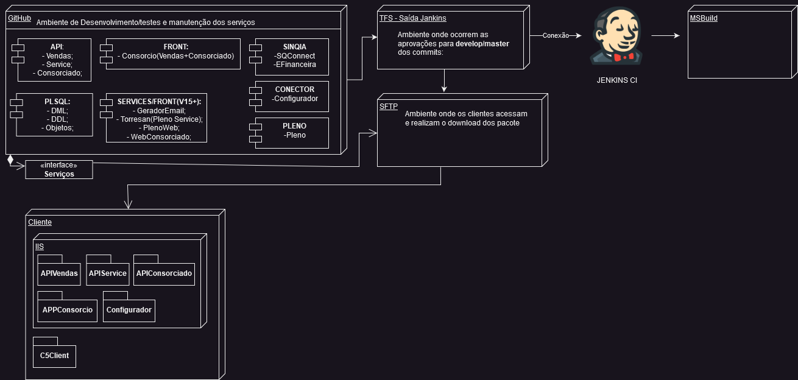

## Integração contínua com Jenkins

Recursos utilizados:
- Versão SDK DotNet : V6.0.118 [**Baixe aqui**](https://github.com/dotnet/core/blob/main/release-notes/6.0/6.0.18/6.0.118.md) .Disponível também na estrutura do projeto **/Jenkins/SDK6.0**;
- Plugin MSBuild Jenkins;
- IDE Visual Studio Code e extensões:

        1 - ms-dotnettools.vscode-dotnet-runtime; 
        2 - ms-dotnettools.csharp;

#
## Diagrama de Implantação Jenkins

#

## Notas sobre Pipeline
uma pipeline é desenvolvida em comandos Groovy(segue a raia de CD - Continous Developing)

- job : a declaração de um processo a ser realizado;
- pipeline : uma sequencia de estagios no seu processo;
- estagio(stages) : é constituido de diversas etapas para realizar tarefas específicas;

declaração de comandos:
- stages : contem um conjunto de estágios
- stage : está contido em um conjunto de estágios